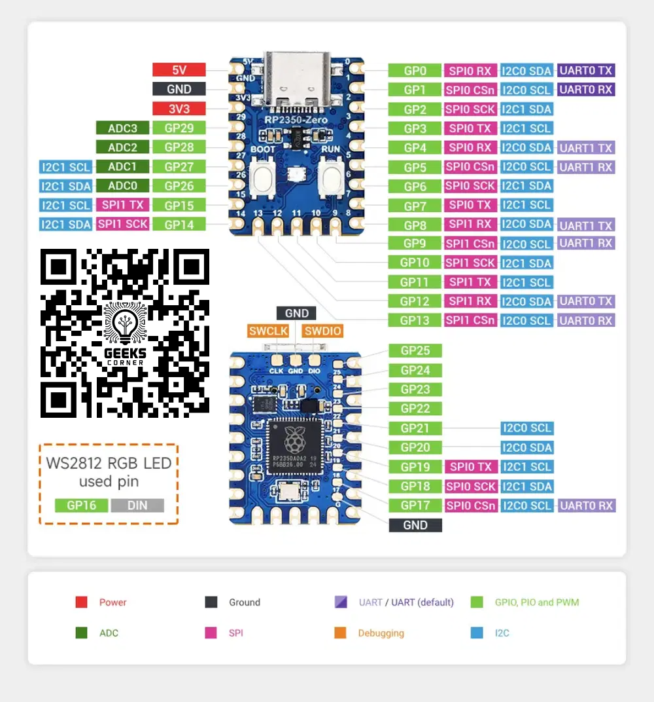

# RPI Pico rp-2040-Zero by waveshare

## Introduction

In this project I'm using a clone of the original [rp2040-zero](https://www.waveshare.com/wiki/RP2040-Zero).
If you live in an advanced economy country please consider buying the original and avoid buying cheap chinese clones.

But if you live Egypt and you're كحيان like me then you can buy it from [GeeksCorner](https://geeks-corner.vatrin.app/p/waveshare-raspberry-pi-pico-rp2040-zero/?order_by[]=collection_display_order&order_by[]=inserted_at&order_directions[]=asc_nulls_last&order_directions[]=desc&page_size=72#products-1)

## To download the bootloader for uploading code on windows

- You can read this discussion on [PlatformIO](https://community.platformio.org/t/raspberry-pi-pico-rp2040-will-not-upload-when-using-my-windows-pc-all-other-boards-work/29852/3)
- OR follow the following steps to Update the USB Drivers
  - The most reliable way to fix this is to install the correct driver for the Pico's bootloader mode. This is a one-time process that will allow PlatformIO to automatically upload firmware without manual intervention.
  - Download Zadig: Go to the [Zadig website](https://zadig.akeo.ie/) and download the latest version of the tool.
  - Enter Bootloader Mode: Press and hold the `BOOT` button on your Pico while plugging it into your computer's USB port. It will appear as a removable drive named RPI-RP2.
  - Run Zadig: Open the Zadig application. In the options menu, select List All Devices.
  - Install the Driver: In the device list, **find "RP2 Boot (Interface 1)"**. From the dropdown menu on the right, select **WinUSB**. Click the "Replace Driver" or "Install Driver" button.
  - Reconnect: Unplug and then replug your Pico (you don't need to hold the BOOT button this time).

# Extra info

- You'll find all the libraries beeing used saved under `.pio/libdep/` if you want to check the code.
- If you installed the recommended ECU and I recommend you do then you'll have `clangd` which will index the code for you.
- You can find The `compile_commands.json` file(which tells clangd exactly how each file will compile) under `.pio\build\compile_commands.json`.
- To enter Bootloader mode and get rp-2040 to act as a mass storage device if you want to upload the firmware(`.pio\build\pico\firmware.elf.uf2`) manually then hold the `BOOT` button on the board then plugin the USB or if device is already connected then hold `Boot` button then press the `RESET` button while you're holding `BOOT`.

## Contact GeeksCorner

| [Facebook](https://www.facebook.com/profile.php?id=61580976832543)             |  [Whatsapp](https://wa.me/201100045221) |
:-------------------------:|:-------------------------:
 | 
